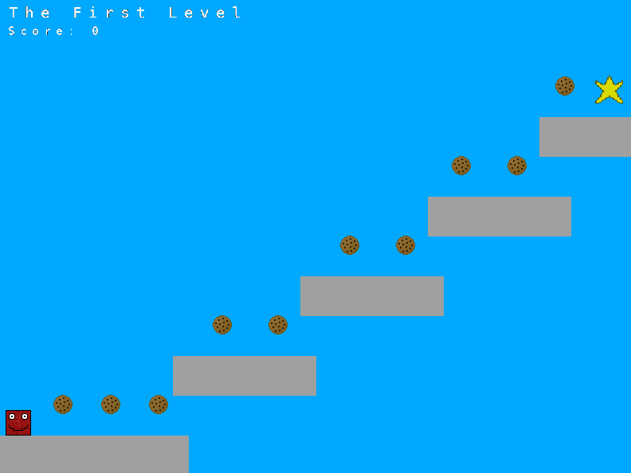

# Custom OS Game

This project contains an implementation of an operating system specifically made for the purpose of running a simple platformer game. The OS uses GRUB to handle the switch to protected mode and graphics mode, and the STB image library implementation to convert images to C structures. Everything else is made from scratch, including the kernel, memory and string libraries, dynamic memory allocation/deallocation, graphics, input handling, and game logic.

## Compilation

The compilation of the OS requires an i686 cross compiler to be located in the `~/opt/cross/bin` directory, as well as support for C++ 20, and the `grub-mkrescue` command. Once all of that has been setup, run `make` in the root project directory (directory where this README is located), which will build the image conversion tool, convert images to C files, and build the iso file in the `bin` directory.